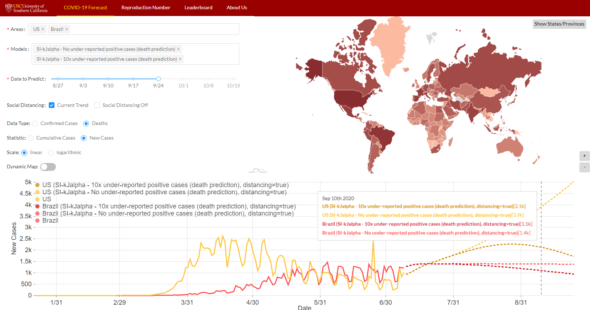

# ReCOVER: Accurate Predictions and Resource Allocation for COVID-19 Epidemic Response

PIs: Viktor K. Prasanna (prasanna@usc.edu), Ajitesh Srivastava (ajiteshs@usc.edu)
University of Southern California

### Code contributors: 

Ajitesh Srivastava, Frost Xu, Bob Xiaochen Yang, Jamin Chen

## Approach
We use our own epidemic model called SI-kJalpha, preliminary version of which we have successfully used during [DARPA Grand Challenge 2014](https://news.usc.edu/83180/usc-engineers-earn-national-recognition-for-predicting-disease-outbreaks/). Our forecast appears on the official [CDC webpage](https://www.cdc.gov/coronavirus/2019-ncov/covid-data/forecasting-us.html).Our model can consider the effect of many complexities of the epidemic process and yet be simplified to a few parameters that are learned using fast linear regressions. Therefore, our approach can learn and generate forecasts extremely quickly. On a 2-core desktop machine, our approach takes only 3.18s to tune hyper-parameters, learn parameters and generate 100 days of forecasts of reported cases and deaths for all the states in the US. The total execution time for 184 countries is 11.83s and for more than 3000 US counties is 101.03s. Despite being fast, the accuracy of our forecasts is on par with the state-of-the-art as demonstrated on the [leaderboard page](https://scc-usc.github.io/ReCOVER-COVID-19/#/leaderboard).

## Web Interface and Visualization

Explore our US state-level and global country-level forecasts here: https://scc-usc.github.io/ReCOVER-COVID-19/

                       

## Our papers
1. Initial Modeling: https://arxiv.org/abs/2004.11372
2. Identifying Unreported Cases: https://arxiv.org/abs/2006.02127

## Presentations/Seminars

Here is a relevant presentation at the start of the project: https://www.youtube.com/watch?v=ll6k8wlxOFo
Note that the project has evolved since then.

## Acknowledgement

This work is supported by National Science Foundation Award No. 2027007 (RAPID).